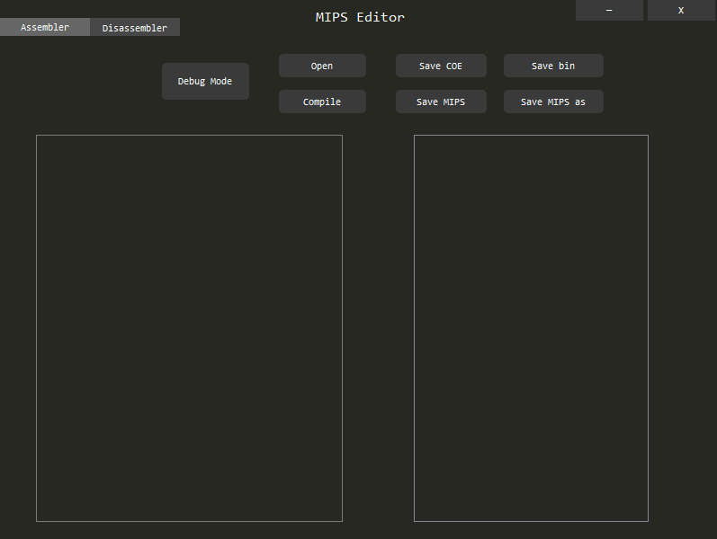
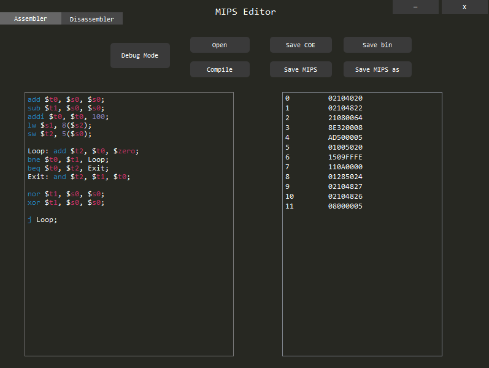
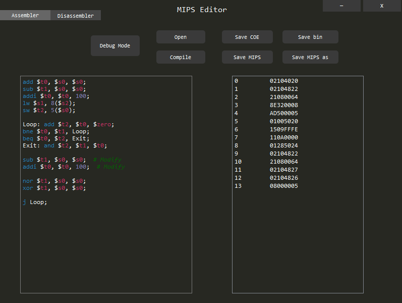
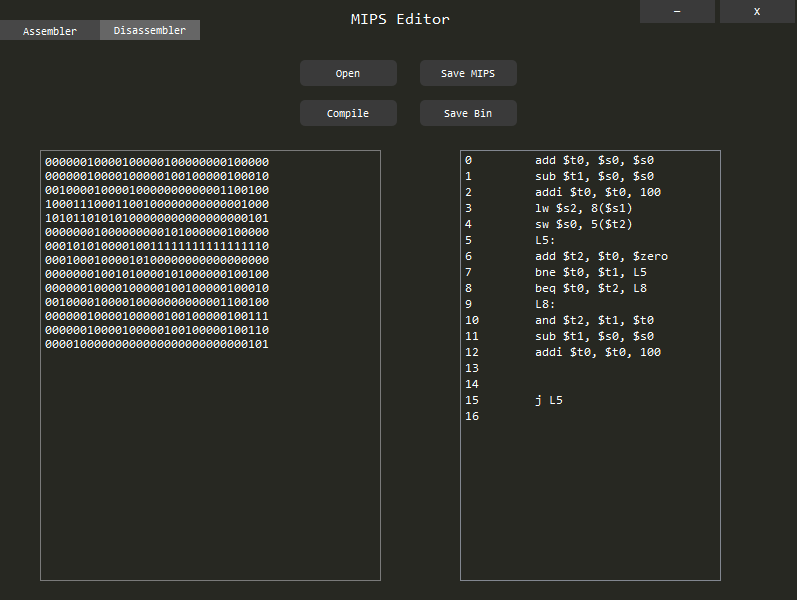
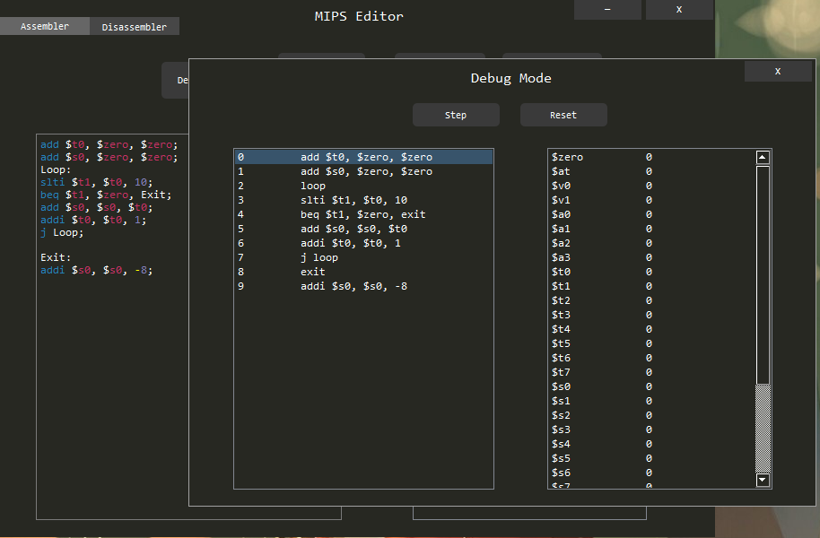
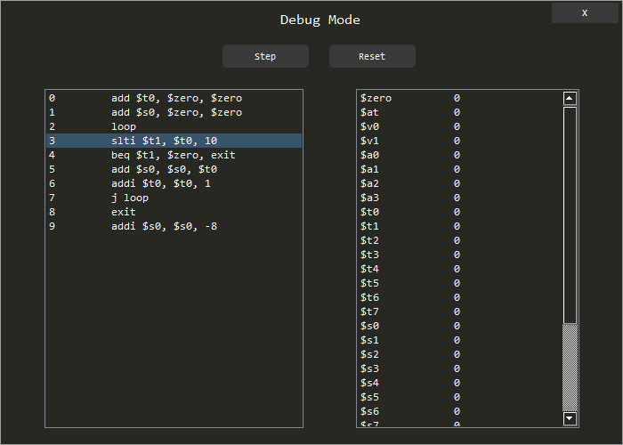
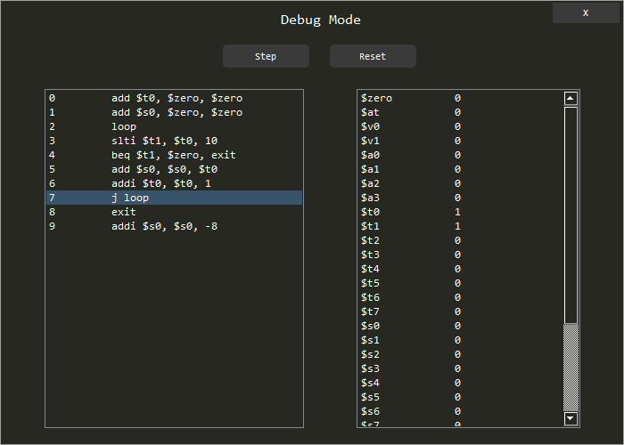
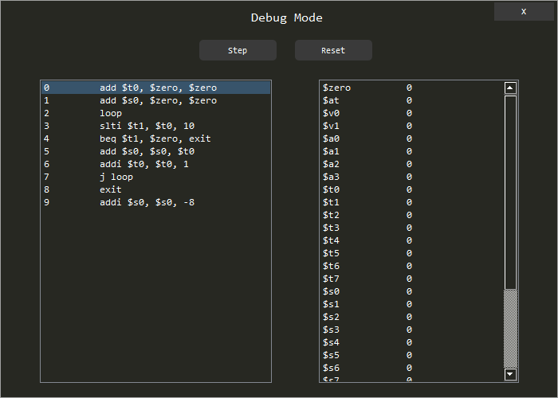

# 
 A Simple MIPS IDE 

[TOC]

## 总体界面

## 一、汇编器

### 1) 支持MIPS指令：

- 基本指令：Add, Sub, And, Or, Addi, Ori, Sll, Srl, Lw, Sw, Lui, Slt, Slti, Beq, Bne, J, Jal, Jr
- 扩展指令：Lb, Lbu, Lh, Lhu, Sb, Sh, Addu, Subu, Sltu, Xor, Nor, Sra, Mult, Multu, Div, Divu, Addi, Addiu, Andi, Ori, Xori, Blez, Bgtz
- 伪指令：BaseAddr

### 2) 功能介绍

| 按钮           | 功能                 | 快捷键              |
| ------------ | ------------------ | ---------------- |
| Open         | 打开MIPS源码文件         | Ctrl + O         |
| Compile      | 编译MIPS源码，显示在右边文本框中 | Ctrl + B         |
| Save COE     | 把编译结果保存为COE文件      | Ctrl + E         |
| Save MIPS    | 保存MIPS源码文件         | Ctrl + S         |
| Save bin     | 把编译结果保存为二进制文件      | Ctrl + I         |
| Save MIPS as | 把MIPS源码另存为         | Ctrl + Shift + S |

### 3) 文本编辑功能

- 支持实时编辑，可以直接在代码框内编辑，点击Compile(Ctrl + B)显示编译结果

-  支持代码块语法高亮

| 类别   | 指令   | 寄存器  | 注释   | 数字   | 其他   |
| ---- | ---- | ---- | ---- | ---- | ---- |
| 颜色   | 蓝    | 红    | 绿    | 紫    | 白    |

语法高亮的代码由PyQt官方给出的示例代码修改而得：[https://wiki.python.org/moin/PyQt/Python%20syntax%20highlighting](https://wiki.python.org/moin/PyQt/Python%20syntax%20highlighting)

## 二、反汇编器

### 1）支持MIPS指令

- 基本指令：Add, Addi, And, Beq, Bne, J, Jal, Jr, Lw, Lui, Or, Ori, Sll, Slt, Slti, Srl, Sw, Sub,
- 扩展指令：Xor, Xori, Andi

### 2）功能介绍

| 按钮        | 功能             | 快捷键      |
| --------- | -------------- | -------- |
| Open      | 打开二进制文件        | Ctrl + O |
| Compile   | 把二进制码编译为MIPS指令 | Ctrl + B |
| Save MIPS | 把编译出来的MIPS指令保存 | Ctrl + S |
| Save Bin  | 保存二进制文件        | Ctrl + I |

### 3）编辑功能

支持实时编辑二进制代码，点击Compile (Ctrl + B) 反编译为MIPS指令

##  三、调试模式

### 1) Step —— 单步运行
  从第一行开始运行，下一步要执行的指令会用蓝色底色高亮出来，右侧为寄存器的值。

- 支持跳转指令

### 2) Reset —— 重置运行状态和寄存器的值

